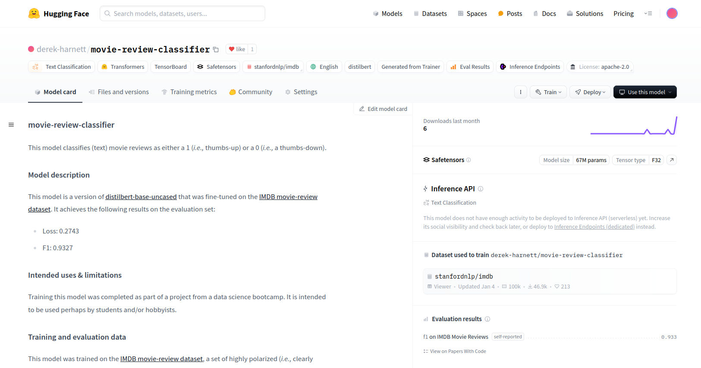

# Sentiment Analysis of Movie Reviews

In this project, I trained various classifiers to predict whether a particular movie review is positive (*i.e.,* thumbs-up) or negative (*i.e.,* thumbs-down). All classifier models used were trained and tested on a labelled dataset of movie reviews from [IMDB](https://www.imdb.com/). Two approaches were tried. The first approach (see the first notebook) used the TF-IDF algorithm in conjunction with several classifiers from scikit-learn. The second approach (see the third notebook) used the transformers library and a pre-trained LLM which was then fine-tuned using the movie-review train set. The results of the second approach were significantly better than the first. The first approach yielded a test F1-score of 0.875 whereas the second approach yielded a test F1-score of 0.933. The best model from the first approach was deployed using Flask (see the second notebook). The fine-tuned model of the second approach was delpoyed on [Hugging Face](https://huggingface.co/derek-harnett/movie-review-classifier#movie-review-classifier).

## Dataset

As noted above, in this project, I used the [IMDB large movie-review dataset](https://huggingface.co/datasets/stanfordnlp/imdb) of highly polarized movie reviews. The dataset contained labelled train and test data as well as unlabelled data. Each subset of the dataset had two columns: 'text' and 'label'. The 'text' columns consisted of natural language text reviews. The 'label' columns contained 1's and 0's: 1 for a positive review and 0 for a negative review. Both train and test datasets contained 25k samples. (The unlabelled set contained 50k samples.) Also, both train and test datasets were perfectly balanced, each containing 12,500 1's and 12,500 0's.

## Pre-trained Model

In the second training approach, I used the pre-trained `distilBERT-base-uncased` model. It is a lighter, faster version of `BERT`. The pre-trained model was trained on 11k+ unpublished books in addition to English Wikipedia---about 16GB worth of text data. The model has 66 million parameters and a 30k-word vocabulary. One of its intended use cases is sentiment analysis, the focus of this project.

## Performance Metric

When training the models of this project, I focused on F1-score. Recall that the movie-reviews train dataset is perfectly balanced with respect to review labels. Also, there is really no difference between the consequences associated with false postives or false negatives in movie-review classification. For these reasons, F1-score is the most important metric for this project as it represents a type of average between precision and recall, neither of which can be considered more important than the other in this particular application. 

## Results

As discussed above, to generate a movie-review classifier, I tried two approaches. The first approach was to apply classifiers from scikit-learn to text data that had been vectorized using the TF-IDF algorithm. The best model from this approach turned out to be logistic regression which yielded a test F1-score of 0.875. The second approach was to fine-tune a pre-trained LLM. On test data, this approach yielded an F1-score of 0.933, a significant improvement over the first approach.

## Deploying the Flask app

As noted above, the best-scoring model from the first approach was deployed as a local server using Flask. To run this server, first clone the repo 

```bash
$ git clone https://github.com/harnettd/llm-project.git
$ cd llm-project
```

Second, setup the needed Python environment using either

```bash
$ python -m venv venv
$ source venv/bin/activate
$ pip install -r requirements.txt
```

or

```bash
$ conda env create -f environment.yaml
$ conda activate nlp 
```

Third, start the server

```bash
$ python -m app.api
```

With the server running, the second notebook which sends POST requests to the server can be run.

## Important Links

- [IMDB large movie-review dataset](https://huggingface.co/datasets/stanfordnlp/imdb)
- [movie-review-classifier at Hugging Face](https://huggingface.co/derek-harnett/movie-review-classifier)

## Screenshot


