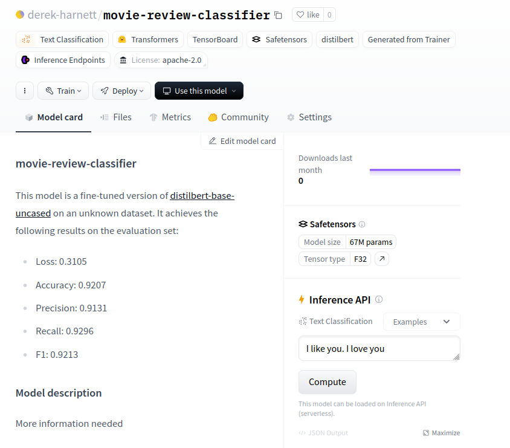

# LLM Project

## Project Task

The purpose of this project was to train a classifier to predict whether a particular movie review is positive (*i.e.,* thumbs-up) or negative (*i.e.,* thumbs-down). The classifier was trained and tested on a labelled dataset of movie reviews from [IMDB](https://www.imdb.com/). Two approaches were tried. The first approach was to tokenize and vectorize the reviews using the TF-IDF algorithm. The resulting vectorized movie reviews and corresponding labels were then used to train a random forest classifier. The second approach was to start from a pre-trained LLM which was then fine-tuned using the movie-review training set. Unsurprisingly, the results of the second approach were much better than the first. The final model of the second approach was delpoyed both locally through a server set up using Flask, and on [Hugging Face](https://huggingface.co/).

## Dataset

As noted above, in this project, I used the [IMDB large movie-review dataset](https://huggingface.co/datasets/stanfordnlp/imdb) of highly polarized movie reviews. The dataset contained labelled training and test data (as well as unlabelled data that I didn't use for this project.) Each dataset had two columns: 'text' and 'label'. The 'text' columns consisted of natural language text reviews. The 'label' columns contained 1's and 0's: 1 for a positive review and 0 for a negative review. Both training and test datasets contained 25,000 samples and no null entries. Also, both training and test datasets were perfectly balanced, each containing 12,500 1's and 12,500 0's.

## Pre-trained Model

For the pre-trained model, I used `distilBERT-base-uncased`. It is a lighter, faster version of BERT. It was trained on 11,000+ unpublished books in addition to English Wikipedia, about 16GB worth of text data. The model has 66 million parameters and a 30,000 word vocabulary. One of its intended use cases is sentiment analysis, the focus of this project.

## Performance Metrics

When training my model, I monitored the four metrics accuracy, precision, recall, and F1-score.Note that the movie-reviews dataset is perfectly balanced with respect to review labels. Also, there is ostensibly no difference between the consequences associated with false postives or false negatives. For these reasons, I think that F1-score is the most important metric for this project as it represents a type of average between precision and recall, neither of which can be considered more important than the other with regards to this particular application.

## Hyperparameters

When working with `distilBERT-base-uncased`, I began my tuning process on a subset of 5,000 movie reviews using the following baseline set of hyperparameters: 

- learning_rate = 2e-5
- per_device_train_batch_size = 8
- per_device_eval_batch_size = 8

I changed the values of these parameters and monitored the model's F1-score for significant changes.

Both increasing and decreasing learning_rate by an order of magnitude significantly decreased the model's F1 score. As for the two batch-size hyperparameters, setting them to 4, 8, or 16 had little impact on the model's F1-score. Increasing either batch size to 32 caused the model's F1-score to decrease somewhat. However, decreasing the batch sizes did increase the time it took to train the model. As such, I settled on the hyperparameter values:

- learning_rate = 2e-5
- per_device_train_batch_size = 16
- per_device_eval_batch_size = 16

Having settled on the above hyperparameter values, I then obtained my final model by training on 12,500 reviews from the training set over 3 epochs.  

## Results

To generate a sentiment-analysis tool, I tried two approaches. The first approach was to apply a random forest classifier to text data that had been vectorized using the TF-IDF algorithm. On test data, this approach yielded an F1-score of 0.80. The second approach was to tune a previously trained LLM on the movie-review test data. On test data, this approach yielded an F1-score of 0.92, a major improvement over the first appraoch.

To be fair, however, the first approach was implemented on a PC and used a training set consisting of 7,500 samples and a 750 feature-vocabulary. The second approach was implemented on Google colab. The model was trained on 12,500 samples with no explicit restrictions on vocabulary length. As a future goal, I would implement the first approach on Google colab so that the two models could be compared directly, having been trained with the same computing resources. 

## Important Links

- [IMDB large movie-review dataset](https://huggingface.co/datasets/stanfordnlp/imdb)
- [movie-review-classifier at Hugging Face](https://huggingface.co/derek-harnett/movie-review-classifier)

## Screenshot

